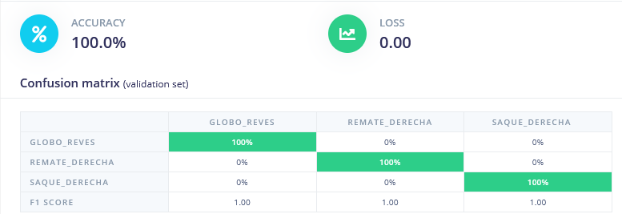
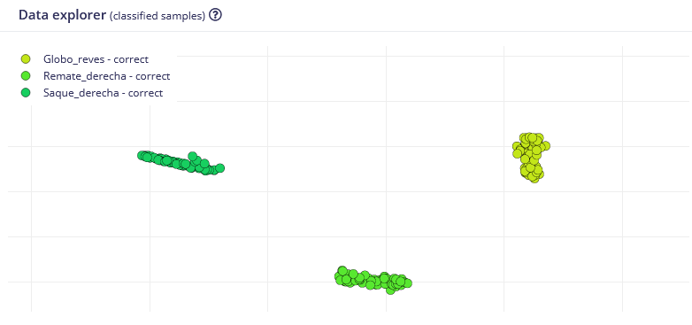

## Analisis de muestras y etrenaiento del modelo

El objetivo es clasificar automáticamente tres tipos de golpeo de bádminton:

| Clase | Descripción |
|---|---|
| `Saque_derecha` | Saque de derechas |
| `Globo_reves` | Globo recto de revés |
| `Remate_derecha` | Remate de derechas |

El sistema utiliza un **Arduino Nano 33 BLE Sense** sujeto a la muñeca mediante una muñequera, capturando datos del acelerómetro, giroscopio y magnetómetro a **100 Hz**. El modelo de clasificación se ejecuta directamente en el microcontrolador (TinyML / Edge AI).

---

## Pipeline de procesado de datos

### 1. Adquisición de datos

- Herramienta: **Edge Impulse Studio** con firmware oficial para Arduino Nano 33 BLE Sense
- Frecuencia de muestreo: **100 Hz**
- Sensores activos: acelerómetro (m/s²), giroscopio (deg/s), magnetómetro (µT)
- Duración de cada muestra: **2000 ms** (200 puntos por muestra)
- Muestras recogidas por clase: **60 aprox**
- Total muestras: **180** (60 × 3 clases)

### 2. Segmentación y split

- Ventana de segmentación: **2000 ms**
- Split train/test: **80% / 20%** (≈ 173 training / 45 test)
- Stride/solapamiento: **200 ms**

### 3. Procesado de señal (DSP block)

- Bloque: **Spectral Analysis** (Edge Impulse)
- Parámetros optimizados con **Autotune**:
  - Filtro: **low-pass** a 1.17 Hz, orden 6
  - Análisis: **Wavelet** (rbio3.9, nivel 1)
- Features de entrada al clasificador: **252**

### 4. Entrenamiento del modelo

- Arquitectura: Red neuronal densa (MLP)
  - Input: 252 features
  - Dense layer: 20 neuronas
  - Dense layer: 10 neuronas
  - Output: 3 clases (softmax)
- Épocas: **100**
- Learning rate: **0.0005**
- Cuantización: **int8** (para despliegue en microcontrolador)

---

## Resultados

### Training set (validación)





### Test set (datos no vistos)

| Métrica | Valor |
|---|---|
| Accuracy | **97.56%** |
| Weighted Precision | 0.98 |
| Weighted Recall | 0.98 |
| Weighted F1 score | 0.98 |
| AUC | 1.00 |

### Confusion matrix (test)

| | Globo_reves | Remate_derecha | Saque_derecha |
|---|---|---|---|
| **Globo_reves** | 100% | 0% | 0% |
| **Remate_derecha** | 0% | 100% | 0% |
| **Saque_derecha** | 0% | 0% | 94.4% |

> El único error registrado es una muestra de `Saque_derecha` clasificada como *uncertain* (5.6%), no como otro golpeo.

### Rendimiento en dispositivo (on-device)

| | Valor |
|---|---|
| Latencia total | **96 ms** |
| RAM utilizada | 8.1 KB |
| Flash modelo | 19.2 KB |

---

## Despliegue

El modelo se exporta como **Arduino library** desde Edge Impulse y se flashea en la placa usando el sketch `nano_ble33_sense_fusion_Trabajo_Final.ino`.

El firmware incluye un **trigger por magnitud de aceleración** para lanzar la inferencia solo cuando se detecta un movimiento brusco (umbral configurable, por defecto ~15 m/s²), evitando clasificaciones en reposo.

### Uso

1. Flashear el firmware en el Arduino Nano 33 BLE Sense
2. Abrir el **Serial Monitor** a 115200 baudios
3. Colocar la placa en la muñequera
4. Realizar un golpeo — el resultado aparece en el monitor serie

```
Sampling...
Predictions (DSP: 81 ms., Classification: 1 ms.):
Globo_reves: 0.00000
Remate_derecha: 0.99219
Saque_derecha: 0.00781
```

---

## ⚠️ Limitaciones y trabajo futuro

- **Sin clase idle:** el modelo no tiene clase de reposo. Como trabajo futuro se propone añadir una clase `idle` con ~50 muestras de movimiento en reposo.
- **Un solo sujeto:** todos los datos fueron recogidos por el mismo jugador. Un modelo más robusto requeriría datos de múltiples sujetos.
- **Golpeos limitados:** el sistema reconoce 3 de los múltiples golpeos posibles en bádminton (smash, clear, drop, net shot, etc.).

---

## 🛠️ Herramientas utilizadas

- [Edge Impulse Studio](https://studio.edgeimpulse.com) — adquisición, procesado y entrenamiento
- [Arduino IDE 2.3.9](https://www.arduino.cc/en/software) — programación de la placa
- Python + openpyxl — exportación de datos a Excel

---

*Universidad de Zaragoza — Redes de Sensores IoT — Curso 2025/26*
