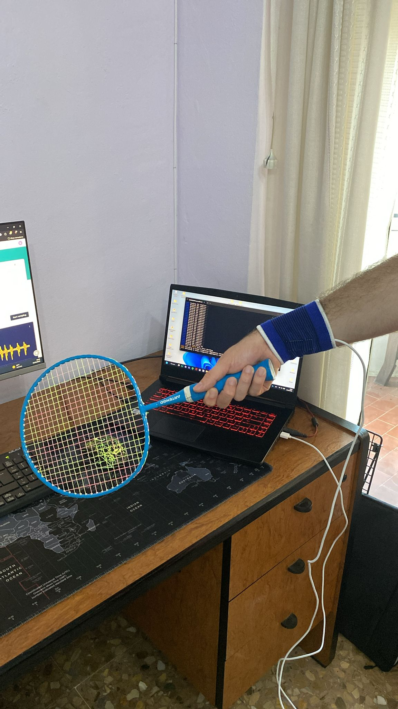

#  Guía de toma de muestras

## 1. Preparación del hardware

1. Conecta el **Arduino Nano 33 BLE Sense** al PC por USB
2. Coloca la placa en la muñequera y sujétala a la **muñeca de la mano dominante**



---

## 2. Conexión a Edge Impulse

1. Abre una terminal y ejecuta:
   ```bash
   edge-impulse-daemon
   ```
2. Introduce tu usuario y contraseña de Edge Impulse
3. Selecciona el proyecto correspondiente
4. Comprueba que la placa aparece conectada en **Devices**

---

## 3. Toma de muestras

1. Ve a **Data acquisition** en Edge Impulse Studio
2. Configura los parámetros:
   - **Label:** nombre del golpeo (`Saque_derecha`, `Globo_reves`, `Remate_derecha`)
   - **Sample length:** 2000 ms
   - **Sensor:** Inertial (Accelerometer / Gyroscope / Magnetometer)
   - **Frequency:** 100 Hz
3. Pulsa **Start sampling**
4. Cuando aparezca `Sampling...` en pantalla, ejecuta el golpeo
5. Repite el proceso hasta obtener **~60 muestras por clase**
6. Separa cada uno de los golpeos manualmente en ventanas de 2000 ms

> Intenta que el golpeo ocurra en el centro de la ventana de grabación.

---

## 4. Split train/test

1. En **Data acquisition**, pulsa el icono de split (junto al dataset)
2. Edge Impulse sugiere automáticamente **80% training / 20% test**
3. Pulsa **Perform train/test split**

| Set | Muestras |
|---|---|
| Training | 173 |
| Test | 45 |
---
