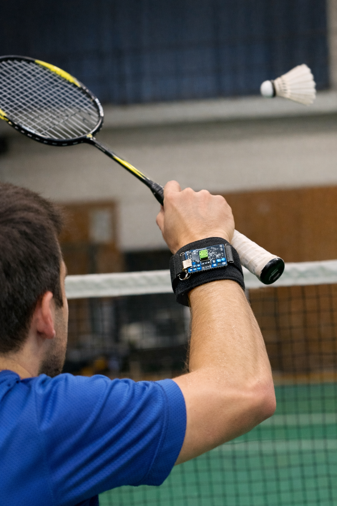

# Proyecto-Final-RSE
EN este repositorio es donde se ire subiendo todo el contenido y los avances del proyecto final de la asignatura de"Redes de sensores electrónicos" del master de Ingenieria Electronica.

---

  

## Descripción del Proyecto
El objetivo del proyecto es el diseño e implementación de un sistema embebido capaz de reconocer distintos tipos de golpeos en bádminton mediante el uso de sensores como acelerometros y giroscopio.
El sistema se basa en la adquisición de datos del acelerómetro y giroscopio, la generación de una base de datos propia y el posterior entrenamiento de un modelo de clasificación que permita distinguir entre distintos movimientos. La idea consiste en colocar el dispostivo en la muñeca del usuario y de esta manera ser capaz de detectar el tipo de golpeo ejecutado.

---
## Objetivos
- Generar una base de datos mediante el uso de acelerometros para los distintos tipos de golpeos.
- Diseñar un algoritmo capaz de clasificar 3 o 4 golpeos diferentes de badminton de manera eficiente gracias a la base de datos obtenida.
- Programar el firmware necesario para el microcontrolador a usar, para ser capaces de medir todos los datos necesarios para generar una base de datos propia.
---

## Autor

Marco Ruiz NIA: 827133 
Máster en Ingeniería Electrónica